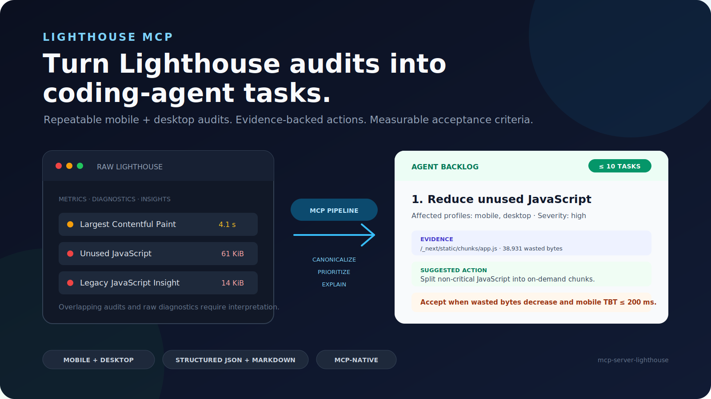

# Agent Audit

## Turn Lighthouse audits into coding-agent fix packs.

Run repeatable mobile and desktop Lighthouse audits from any compatible MCP
client. Receive a bounded implementation backlog with evidence, suggested
actions, and measurable acceptance criteria as structured JSON and Markdown.

```bash
npx -y agent-audit
```



## Why Agent Audit?

Raw Lighthouse output is designed for diagnostics, not autonomous
implementation. It contains metrics, audit details, overlapping insights, and
page-controlled text that a coding agent still needs to interpret.

Agent Audit turns that output into a stable workflow:

1. Run Lighthouse for mobile and desktop.
2. Aggregate repeated runs and expose variability.
3. Merge equivalent audits under canonical task IDs.
4. Keep raw metrics out of the implementation backlog.
5. Return at most ten prioritized tasks with evidence and acceptance criteria.

## From Audit Noise To An Implementation Plan

Each prioritized task can include:

- affected mobile and desktop profiles;
- resource URLs or DOM selectors;
- estimated time or byte savings;
- deterministic suggested actions;
- measurable acceptance criteria.

See the real [CommaLabs JSON report](examples/commalabs-fast-report.json) and
[Markdown report](examples/commalabs-fast-report.md).

> Lighthouse results vary with browser version, hardware, network conditions,
> and page changes. The example demonstrates the report format, not a permanent
> performance score.

## Install

### Requirements

- Node.js 20 or later
- Google Chrome or Chromium

The package is an MCP server distributed through npm. Your MCP client starts it
as a local stdio process:

```bash
npx -y agent-audit
```

Future releases can be published through the GitHub Actions release workflow
once npm trusted publishing is configured for the package.

### Claude Desktop

Open Claude Desktop's developer configuration and add:

```json
{
  "mcpServers": {
    "agent-audit": {
      "command": "npx",
      "args": ["-y", "agent-audit"]
    }
  }
}
```

Restart Claude Desktop after saving the configuration. See the
[official MCP local-server guide](https://modelcontextprotocol.io/docs/develop/connect-local-servers).

### Claude Code

Add the server with the Claude Code CLI:

```bash
claude mcp add agent-audit -- npx -y agent-audit
```

For local development audits, pass the explicit localhost opt-in:

```bash
claude mcp add agent-audit-local -- npx -y agent-audit --local
```

See the [official Claude Code MCP documentation](https://code.claude.com/docs/en/mcp).

### Codex

Add the server with the Codex CLI:

```bash
codex mcp add agent-audit -- npx -y agent-audit
```

Or add it to `~/.codex/config.toml`:

```toml
[mcp_servers.agent-audit]
command = "npx"
args = ["-y", "agent-audit"]
```

See the [official Codex MCP documentation](https://developers.openai.com/codex/mcp).

### VS Code And GitHub Copilot

Create a workspace or user-level `.mcp.json` file with:

```json
{
  "servers": {
    "agent-audit": {
      "command": "npx",
      "args": ["-y", "agent-audit"]
    }
  }
}
```

You can also register the server from a terminal:

```bash
code --add-mcp '{"name":"agent-audit","command":"npx","args":["-y","agent-audit"]}'
```

See the [official VS Code MCP server documentation](https://code.visualstudio.com/docs/agent-customization/mcp-servers).

### Cursor

Configure a local stdio MCP server:

- name: `agent-audit`
- command: `npx`
- arguments: `-y`, `agent-audit`

If your Cursor version supports environment variables for MCP servers, add
`--local` to the server arguments when you need localhost audits.

### Other MCP Clients

For clients that accept the standard `mcpServers` JSON shape, use the Claude
Desktop configuration above. Otherwise configure a local stdio server with:

- command: `npx`
- arguments: `-y`, `agent-audit`

## Localhost And Private Targets

By default, Agent Audit only accepts publicly routable HTTP and HTTPS URLs.
This is the correct default for hosted agents and shared environments.

For developer machines, enable explicit localhost auditing:

```bash
npx -y agent-audit --local
```

Then audit the local app through your MCP client:

```json
{
  "url": "http://localhost:3000",
  "mode": "fast"
}
```

The opt-in only allows loopback-style targets such as `localhost`,
`*.localhost`, `127.0.0.0/8`, and `::1`. Private LAN ranges, link-local
addresses, multicast/reserved ranges, and cloud metadata addresses remain
blocked.

The environment variable form remains supported for clients that cannot pass
extra CLI arguments:

```bash
LIGHTHOUSE_MCP_ALLOW_LOCALHOST=true npx -y agent-audit
```

## Tool

### `analyze_website_performance`

Runs Lighthouse against a public HTTP or HTTPS URL:

```json
{
  "url": "https://example.com",
  "mode": "reliable"
}
```

`mode` is optional:

- `fast`: one mobile run and one desktop run.
- `reliable`: three runs per profile, median results, and variability ranges.
  This is the default.

## What The Report Contains

- Mobile and desktop Performance, Accessibility, Best Practices, and SEO scores
- FCP, Speed Index, LCP, TBT, and CLS distributions
- At most ten canonical prioritized issues
- Up to ten evidence rows per issue
- Resource URLs, DOM selectors, and console error evidence when available
- Single-URL site intelligence for broken links, metadata, JSON-LD, indexability, images, assets, and LLM visibility
- Generated `llms.txt` draft when page content is sufficient
- Suggested actions and measurable acceptance criteria
- Profile warnings when repeated runs vary materially
- Canonical `structuredContent` validated by the advertised MCP `outputSchema`
- Equivalent Markdown generated from the same canonical report

If only one profile produces enough successful runs, the report has
`status: "incomplete"`. It remains useful for diagnosis but must not be treated
as a release baseline.

## Site Intelligence

In addition to Lighthouse, the tool inspects the requested page and bounded same-origin resources. It reports broken links, page metadata issues, JSON-LD syntax issues, robots/sitemap/indexability signals, image optimization findings, CSS/JavaScript optimization findings, and a conservative `llms.txt` draft.

The MVP is single-URL by design. It does not crawl the whole site, modify Shopify or CMS settings, compress images, minify code, create redirects, or submit IndexNow requests.

## Coding-Agent Workflow

Treat `structuredContent` as the source of truth and Markdown as the execution
summary:

> Inspect the repository before mapping findings to files. Implement issues in
> `prioritizedIssues` order, preserve behavior and accessibility, run repository
> tests after each logical fix, then rerun Lighthouse in reliable mode and
> compare medians, ranges, and acceptance criteria. Do not claim completion from
> an incomplete baseline.

## Security Model

The URL policy rejects:

- protocols other than HTTP and HTTPS;
- URLs containing embedded credentials;
- localhost names unless `LIGHTHOUSE_MCP_ALLOW_LOCALHOST=true` is set;
- loopback IPs unless `LIGHTHOUSE_MCP_ALLOW_LOCALHOST=true` is set;
- private, link-local, multicast, reserved, and metadata-network IPs;
- non-localhost hostnames that resolve to any non-public address.

These checks reduce SSRF exposure but do not replace infrastructure controls.
Production operators should run the server in an isolated environment and deny
outbound access to private networks and cloud metadata services. Redirects and
DNS rebinding are best controlled at the network boundary.

The page-inspection fetcher uses the same URL policy as Lighthouse navigation
and applies timeout, byte-size, and bounded-resource limits.

Page-controlled Lighthouse titles, descriptions, URLs, selectors, and snippets
are sanitized and length-limited. Consumers must still treat them as untrusted
evidence, not agent instructions.

Chrome sandboxing is enabled by default. Only isolated environments that cannot
support it should set:

```bash
LIGHTHOUSE_CHROME_NO_SANDBOX=true
```

See [SECURITY.md](SECURITY.md) for reporting and deployment guidance.

## Local Development

```bash
npm install
npm test
npm run check
npm run build
```

Run a real Chrome smoke audit:

```bash
npm run --silent smoke -- https://example.com fast
npm run --silent smoke -- https://example.com reliable
```

The smoke command writes canonical JSON to stdout and equivalent Markdown to
stderr.

## Troubleshooting

**Chrome cannot be found**

Install Google Chrome or Chromium in the environment running the MCP server.

**Chrome fails to start in a container**

Prefer a container configuration that supports the Chrome sandbox. Set
`LIGHTHOUSE_CHROME_NO_SANDBOX=true` only when the surrounding container or
virtual machine provides an equivalent isolation boundary.

**The target URL is rejected**

Only publicly routable HTTP and HTTPS targets are accepted by default. For a
local development server, start Agent Audit with `--local` and use a
loopback URL such as `http://localhost:3000`. Private network addresses remain
blocked.

## Contributing

Focused issues and pull requests are welcome. Read
[CONTRIBUTING.md](CONTRIBUTING.md) before changing the report contract,
security policy, or MCP transport behavior.

## License

[MIT](LICENSE)
