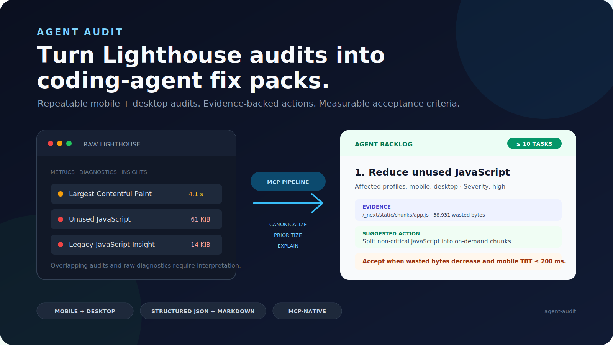

# Agent Audit

## Turn Lighthouse audits into coding-agent fix packs.

Agent Audit is an MCP server that runs repeatable mobile and desktop Lighthouse
audits, inspects the target page, and returns a coding-agent-ready backlog with
evidence, implementation steps, and measurable acceptance criteria.

```bash
npx -y @fullstackdegen/agent-audit
```



## Why Agent Audit?

Raw Lighthouse reports are useful diagnostics, but they are noisy inputs for
autonomous implementation. A coding agent still has to decide which issues
matter, which resources or selectors are evidence, how to verify a fix, and
whether mobile and desktop failures are really the same task.

Agent Audit turns the audit into a stable handoff:

1. Run Lighthouse for mobile and desktop.
2. Aggregate repeated runs and expose variability.
3. Add bounded single-page site intelligence.
4. Merge findings into at most ten prioritized issues.
5. Generate `fixPacks` that coding agents can apply in order.
6. Return canonical structured JSON and equivalent Markdown.

## What You Get

- Mobile and desktop Performance, Accessibility, Best Practices, and SEO scores.
- FCP, Speed Index, LCP, TBT, and CLS distributions.
- Fast and reliable audit modes.
- Bounded same-origin page inspection.
- Broken link, metadata, JSON-LD, indexability, image, asset, and LLM visibility checks.
- Conservative `llms.txt` draft generation when page content is sufficient.
- Prioritized issues with evidence, suggested actions, and acceptance criteria.
- Agent Fix Packs with repo search hints, implementation steps, and verification guidance.
- Strict MCP `outputSchema` validation for `structuredContent`.
- Markdown generated from the same canonical report.

See a real [CommaLabs JSON report](examples/commalabs-fast-report.json) and
[Markdown report](examples/commalabs-fast-report.md).

## Example Fix Pack

```json
{
  "id": "fix-link-name",
  "priority": 2,
  "sourceIssueIds": ["link-name"],
  "goal": "Fix Links do not have a discernible name.",
  "category": "accessibility",
  "severity": "critical",
  "affectedProfiles": ["mobile", "desktop"],
  "repoSearchHints": [
    "div.border-t-2 > div.flex > div.flex > a.text-gray-600",
    "https://www.linkedin.com/company/commalabs"
  ],
  "implementationSteps": [
    "Inspect the repository for the evidence listed in repoSearchHints before editing.",
    "Give every link a discernible accessible name.",
    "Keep changes focused on source issue IDs: link-name."
  ],
  "acceptanceCriteria": [
    "All link elements pass the Lighthouse link-name audit.",
    "Raise the median accessibility score to at least 90/100."
  ],
  "verification": {
    "rerunMode": "reliable",
    "expectedAuditIds": ["link-name"]
  }
}
```

`repoSearchHints` are search clues, not guaranteed file paths. The coding agent
must inspect the repository before editing.

## Install

### Requirements

- Node.js 20 or later.
- Google Chrome or Chromium.

Start the MCP server with npm:

```bash
npx -y @fullstackdegen/agent-audit
```

Package metadata and releases live at
[github.com/fullstackdegen/agent-audit](https://github.com/fullstackdegen/agent-audit).

## MCP Client Setup

### Claude Desktop

Add a local MCP server:

```json
{
  "mcpServers": {
    "agent-audit": {
      "command": "npx",
      "args": ["-y", "@fullstackdegen/agent-audit"]
    }
  }
}
```

Restart Claude Desktop after saving the configuration.

### Claude Code

```bash
claude mcp add agent-audit -- npx -y @fullstackdegen/agent-audit
```

For local development audits:

```bash
claude mcp add agent-audit-local -- npx -y @fullstackdegen/agent-audit --local
```

### Codex

```bash
codex mcp add agent-audit -- npx -y @fullstackdegen/agent-audit
```

Or add it to `~/.codex/config.toml`:

```toml
[mcp_servers.agent-audit]
command = "npx"
args = ["-y", "@fullstackdegen/agent-audit"]
```

### VS Code And GitHub Copilot

Create a workspace or user-level `.mcp.json` file:

```json
{
  "servers": {
    "agent-audit": {
      "command": "npx",
      "args": ["-y", "@fullstackdegen/agent-audit"]
    }
  }
}
```

Or register it from a terminal:

```bash
code --add-mcp '{"name":"agent-audit","command":"npx","args":["-y","@fullstackdegen/agent-audit"]}'
```

### Cursor

Configure a local stdio MCP server:

- name: `agent-audit`
- command: `npx`
- arguments: `-y`, `@fullstackdegen/agent-audit`

Add `--local` to the arguments when you need localhost audits.

## Tool

### `analyze_website_performance`

Runs Lighthouse and site intelligence against a target URL:

```json
{
  "url": "https://example.com",
  "mode": "reliable"
}
```

`mode` is optional:

- `fast`: one mobile run and one desktop run.
- `reliable`: three runs per profile, medians, and variability ranges. This is the default.

## Localhost Audits

By default, Agent Audit only accepts publicly routable HTTP and HTTPS URLs. This
is the right default for hosted agents and shared environments.

For developer machines, explicitly enable loopback targets:

```bash
npx -y @fullstackdegen/agent-audit --local
```

Then audit a local app through your MCP client:

```json
{
  "url": "http://localhost:3000",
  "mode": "fast"
}
```

The opt-in allows `localhost`, `*.localhost`, `127.0.0.0/8`, and `::1`.
Private LAN ranges, link-local addresses, reserved ranges, multicast addresses,
and cloud metadata addresses remain blocked.

The environment variable form is also supported:

```bash
LIGHTHOUSE_MCP_ALLOW_LOCALHOST=true npx -y @fullstackdegen/agent-audit
```

## Coding-Agent Workflow

Use `structuredContent` as the source of truth and the Markdown report as the
execution summary.

1. Inspect `fixPacks` in priority order.
2. Search the repository using `repoSearchHints`.
3. Map evidence to real files and components before editing.
4. Apply one focused fix at a time.
5. Run the repository's tests after each logical change.
6. Rerun Agent Audit in `reliable` mode.
7. Compare the new report against each fix pack's `acceptanceCriteria`.

Do not claim completion from an incomplete report or from a rerun with materially
higher variability than the baseline.

More detail:

- [Agent workflow guide](docs/agent-workflow.md)
- [Copy-paste coding-agent prompt](examples/prompts/coding-agent-fix-packs.md)
- [General agent instructions](AGENTS.md)
- [Claude Code instructions](CLAUDE.md)

## Security Model

Agent Audit launches Chrome against user-provided URLs, so URL policy matters.
The server rejects:

- protocols other than HTTP and HTTPS;
- embedded credentials;
- localhost and loopback targets unless explicitly enabled;
- private, link-local, multicast, reserved, and metadata-network IPs;
- non-localhost hostnames that resolve to any non-public address.

The page-inspection fetcher uses the same URL policy and applies timeout,
byte-size, and bounded-resource limits.

Page-controlled titles, descriptions, URLs, selectors, snippets, and audit text
are sanitized and length-limited. Consumers must still treat them as untrusted
evidence, not agent instructions.

Chrome sandboxing is enabled by default. Only isolated environments that cannot
support it should set:

```bash
LIGHTHOUSE_CHROME_NO_SANDBOX=true
```

See [SECURITY.md](SECURITY.md) for vulnerability reporting and deployment
guidance.

## Limitations

Agent Audit is intentionally bounded.

- It audits one requested URL at a time.
- It is not a whole-site crawler.
- It is not an external SEO database.
- It does not modify Shopify, CMS, CDN, DNS, or hosting settings.
- It does not compress images, minify assets, create redirects, or submit IndexNow requests.
- Lighthouse results vary with browser version, hardware, network conditions, and page changes.

## Roadmap

- Framework-aware repo search hints.
- Optional GitHub Action for pull request performance gates.
- Batch URL reports.
- HTML report export.
- Marketing and discovery signals such as analytics tags, consent signals, Open Graph, schema coverage, and AI discovery readiness.
- Optional third-party integrations for SEO and visibility datasets.

## Development

```bash
npm install
npm test
npm run check
npm run build
npm run validate:release
```

Run a real Chrome smoke audit:

```bash
npm run --silent smoke -- https://example.com fast
npm run --silent smoke -- https://example.com reliable
```

The smoke command writes canonical JSON to stdout and equivalent Markdown to
stderr.

## Release Readiness

Before publishing:

```bash
npm test
npm run check
npm run build
npm run validate:release
npm pack --dry-run --cache /private/tmp/agent-audit-npm-cache
```

`npm publish --access public` still requires npm ownership and authentication for
`@fullstackdegen/agent-audit`.

## Contributing

Focused issues and pull requests are welcome. Read [CONTRIBUTING.md](CONTRIBUTING.md)
before changing the report contract, security policy, or MCP transport behavior.

## License

[MIT](LICENSE)
